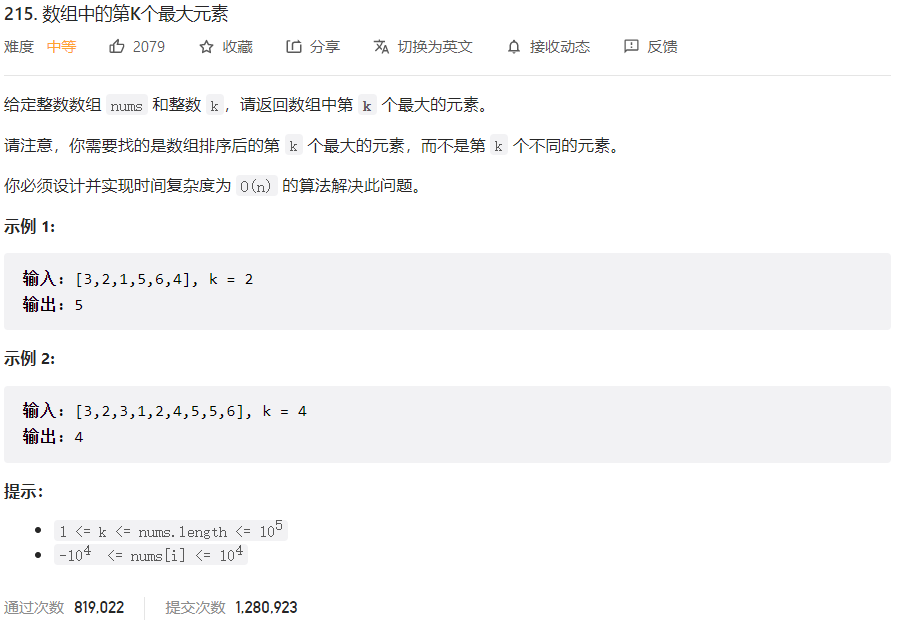



## 题目描述

> 🔥 [215. 数组中的第 K 个最大元素](https://leetcode.cn/problems/kth-largest-element-in-an-array/)



## 思路分析

> - [x] 小顶堆
>
> - [x] 快速选择算法

## 参考代码

```go
func findKthLargest(nums []int, k int) int {
	rand.Seed(time.Now().Unix())
	return quickSelect(nums, 0, len(nums)-1, len(nums)-k)
}

func quickSelect(nums []int, left, right, k int) int {
	if left >= right {
		return nums[left]
	}
	pointIndex := partition(nums, left, right)
	if k == pointIndex {
		return nums[k]
	} else if k < pointIndex {
		return quickSelect(nums, left, pointIndex-1, k)
	} else {
		return quickSelect(nums, pointIndex+1, right, k)
	}
}

func partition(nums []int, left, right int) int {
	pointIndex := rand.Intn(right-left+1) + left
	nums[left], nums[pointIndex] = nums[pointIndex], nums[left]
	point := nums[left]
	i, j := left, right
	for i < j {
		for i < j && nums[j] >= point {
			j--
		}
		if i < j {
			nums[i] = nums[j]
			i++
		}
		for i < j && nums[i] <= point {
			i++
		}
		if i < j {
			nums[j] = nums[i]
			j--
		}
	}
	nums[i] = point
	return i
}
```

<a class="button show-hidden">🍏 点击查看 Java 题解</a>

```java
write your code here
```

## 相似题目

| 题目                                                         | 难度   | 题解 |
| ------------------------------------------------------------ | ------ | ---- |
| [摆动排序 II](https://leetcode.cn/problems/wiggle-sort-ii/) | Medium |      |
| [前 K 个高频元素](https://leetcode.cn/problems/top-k-frequent-elements/) | Medium |      |
| [第三大的数](https://leetcode.cn/problems/third-maximum-number/) | Easy |      |
| [数据流中的第 K 大元素](https://leetcode.cn/problems/kth-largest-element-in-a-stream/) | Easy |      |
| [最接近原点的 K 个点](https://leetcode.cn/problems/k-closest-points-to-origin/) | Medium |      |
