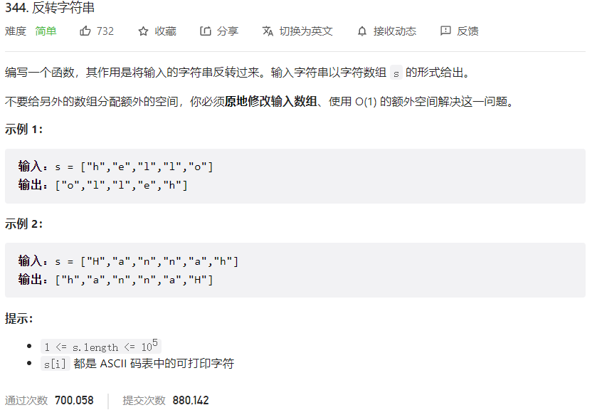



## 题目描述

> 🔥 [344. 反转字符串](https://leetcode.cn/problems/reverse-string/)



## 思路分析

> 双指针

## 参考代码

```go
func reverseString(s []byte) {
	for i, j := 0, len(s)-1; i < j; i, j = i+1, j-1 {
		s[i], s[j] = s[j], s[i]
	}
}
```

<a class="button show-hidden">🍏 点击查看 Java 题解</a>

```java
write your code here
```

## 相似题目

| 题目                                                         | 难度   | 题解 |
| ------------------------------------------------------------ | ------ | ---- |
| [反转字符串中的元音字母](https://leetcode.cn/problems/reverse-vowels-of-a-string/) | Easy |      |
| [反转字符串 II](https://leetcode.cn/problems/reverse-string-ii/) | Easy |      |
