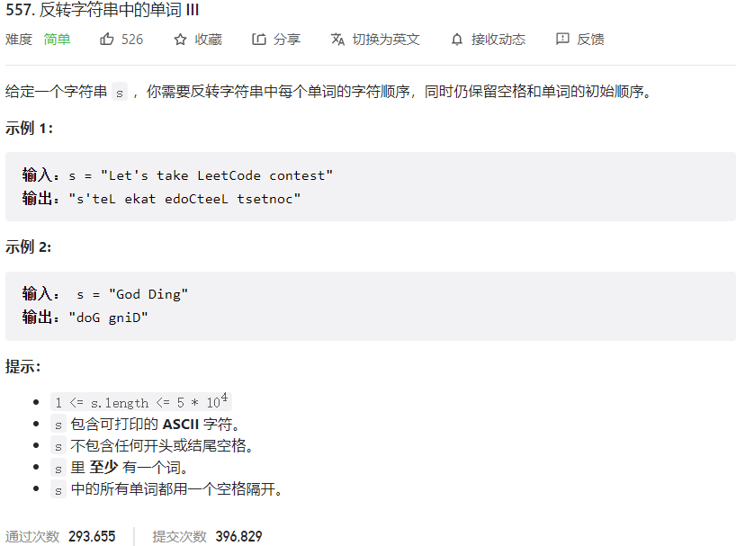



## 题目描述

> 🔥 [557. 反转字符串中的单词 III](https://leetcode.cn/problems/reverse-words-in-a-string-iii/)



## 思路分析

> 思路描述

## 参考代码

```go
func reverseWords(s string) string {
	words := strings.Fields(s)
	for i := 0; i < len(words); i++ {
		words[i] = reverseString(words[i])
	}
	return strings.Join(words, " ")
}

func reverseString(s string) string {
	runes := []rune(s)
	length := len(runes)
	for i, j := 0, length-1; i < j; i, j = i+1, j-1 {
		runes[i], runes[j] = runes[j], runes[i]
	}
	return string(runes)
}
```

<a class="button show-hidden">🍏 点击查看 Java 题解</a>

```java
write your code here
```

## 相似题目

| 题目                                                         | 难度   | 题解 |
| ------------------------------------------------------------ | ------ | ---- |
| [反转字符串 II](https://leetcode.cn/problems/reverse-string-ii/) | Easy |      |
