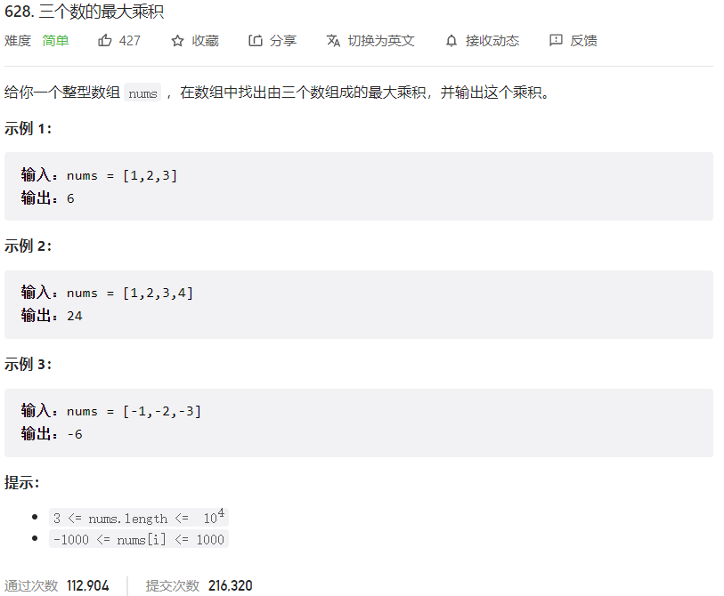



## 题目描述

> 🔥 [628. 三个数的最大乘积](https://leetcode.cn/problems/maximum-product-of-three-numbers/)



## 思路分析

> 数学问题

## 参考代码

```go
write your code here
```

<a class="button show-hidden">🍏 点击查看 Java 题解</a>

```java
write your code here
```

## 相似题目

| 题目                                                         | 难度   | 题解 |
| ------------------------------------------------------------ | ------ | ---- |
| [乘积最大子数组](https://leetcode.cn/problems/maximum-product-subarray/) | Medium |      |
