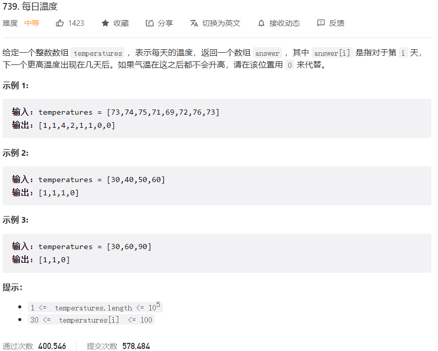



## 题目描述

> 🔥 [739. 每日温度](https://leetcode.cn/problems/daily-temperatures/)



## 思路分析

> 单调递减栈

## 参考代码

```go
func dailyTemperatures(temperatures []int) []int {
	n := len(temperatures)
	res := make([]int, n)
	stack := make([]int, n)
	for i := 0; i < n; i++ {
		for len(stack) > 0 && temperatures[stack[len(stack)-1]] < temperatures[i] {
			index := stack[len(stack)-1]
			stack = stack[:len(stack)-1]
			res[index] = i - index
		}
		stack = append(stack, i)
	}
	return res
}
```

<a class="button show-hidden">🍏 点击查看 Java 题解</a>

```java
write your code here
```

## 相似题目

| 题目                                                         | 难度   | 题解 |
| ------------------------------------------------------------ | ------ | ---- |
| [下一个更大元素 I](https://leetcode.cn/problems/next-greater-element-i/) | Easy |      |
