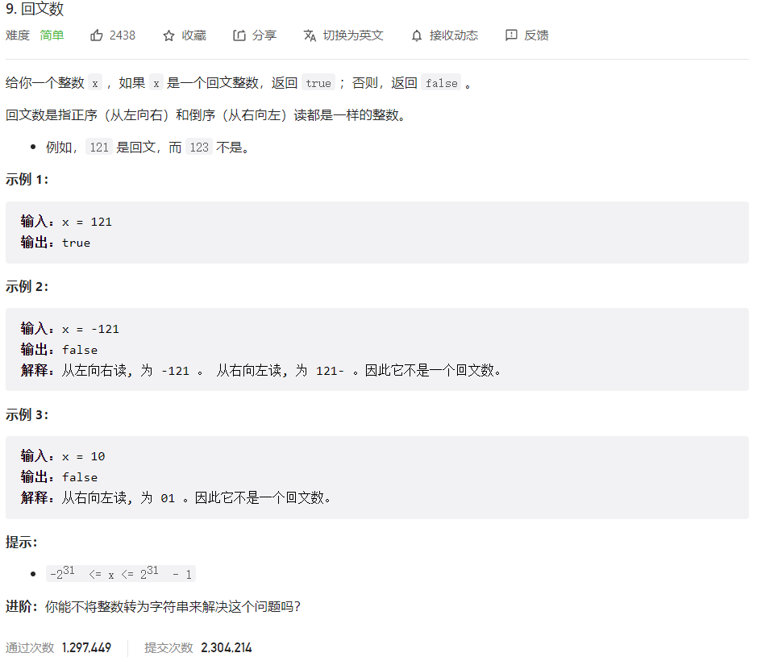



## 题目描述

> 🔥 [9. 回文数](https://leetcode.cn/problems/palindrome-number/)



## 思路分析

> 思路描述

## 参考代码

```go
func isPalindrome(x int) bool {
	if x < 0 {
		return false
	}
	s := strconv.Itoa(x)
	i, j := 0, len(s)-1
	for i < j {
		if s[i] != s[j] {
			return false
		}
		i++
		j--
	}
	return true
}
```

```go
func isPalindrome(x int) bool {
	if x < 0 {
		return false // 负数不是回文数
	}
	original := x
	reversed := 0
	for x > 0 {
		reversed = reversed*10 + x%10
		x /= 10
	}
	return original == reversed
}
```

<a class="button show-hidden">🍏 点击查看 Java 题解</a>

```java
write your code here
```

## 相似题目

| 题目                                                         | 难度   | 题解 |
| ------------------------------------------------------------ | ------ | ---- |
| [回文链表](https://leetcode.cn/problems/palindrome-linked-list/) | Easy |      |
