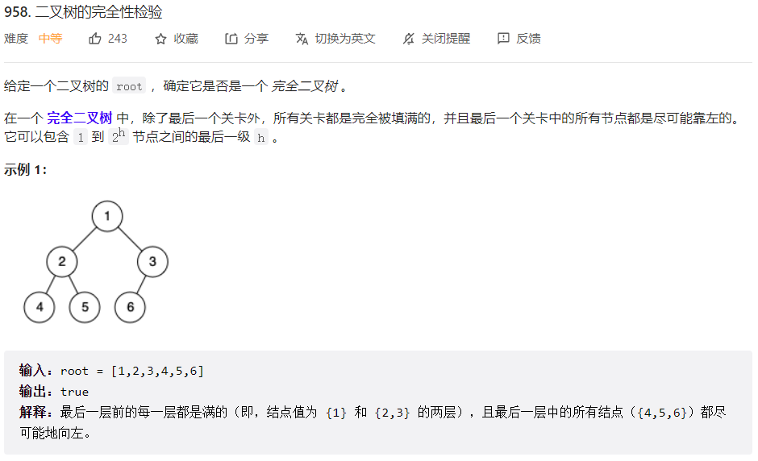
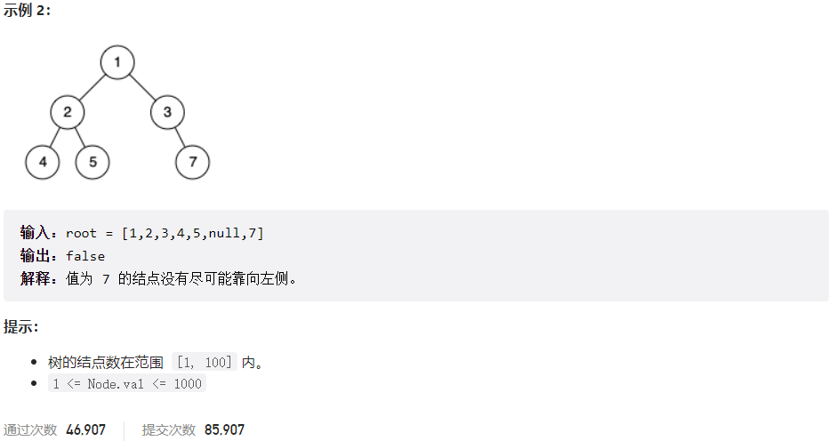



## 题目描述

> 🔥 [958. 二叉树的完全性检验](https://leetcode.cn/problems/check-completeness-of-a-binary-tree/)





## 思路分析

> 完全二叉树的定义是除了最后一层，其他层都是满的，最后一层如果不满，那么所有节点都必须靠左排列。
> 我们可以使用 BFS 遍历二叉树，如果遇到空节点，那么后面的节点都必须是空节点，否则就不是完全二叉树。

## 参考代码

```go
func isCompleteTree(root *TreeNode) bool {
	queue := []*TreeNode{root}
	nullFound := false // 是否找到 null 节点
	for len(queue) > 0 {
		node := queue[0]
		queue = queue[1:]
		// 如果找到 null 节点后，后面不能再有非空节点
		if node == nil {
			nullFound = true
		} else {
			// 如果之前找到了 null 节点，但当前节点不为空，不是完全二叉树
			if nullFound {
				return false
			}
			queue = append(queue, node.Left)
			queue = append(queue, node.Right)
		}
	}
	return true
}
```

<a class="button show-hidden">🍏 点击查看 Java 题解</a>

```java
write your code here
```
