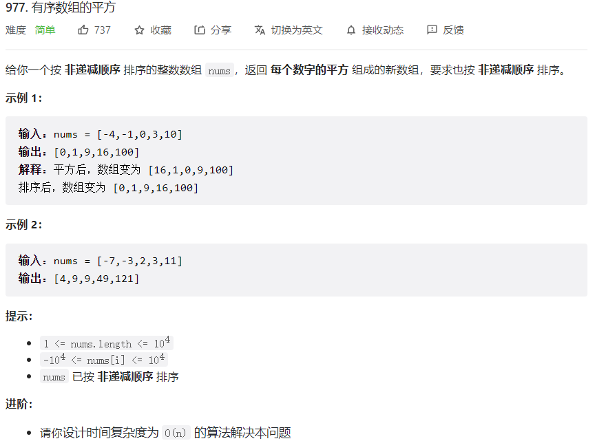



## 题目描述

> 🔥 [977. 有序数组的平方](https://leetcode.cn/problems/squares-of-a-sorted-array/)



## 思路分析

> 思路描述

## 参考代码

```go
write your code here
```

<a class="button show-hidden">🍏 点击查看 Java 题解</a>

```java
write your code here
```

## 相似题目

| 题目                                                         | 难度   | 题解 |
| ------------------------------------------------------------ | ------ | ---- |
| [合并两个有序数组](https://leetcode.cn/problems/merge-sorted-array/) | Easy |      |
| [有序转化数组](https://leetcode.cn/problems/sort-transformed-array/) | Medium |      |
