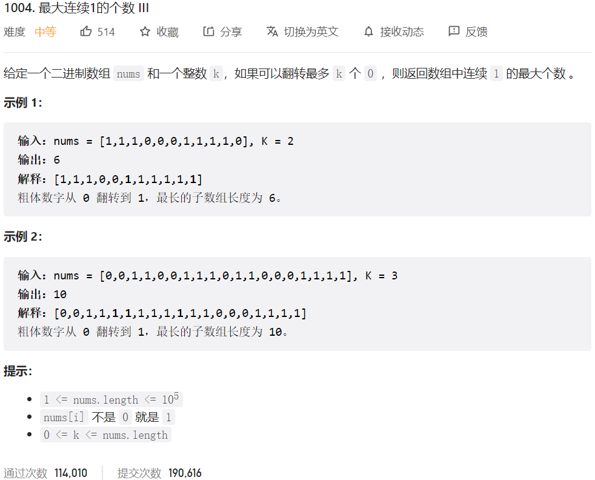



## 题目描述

> 🔥 [1004. 最大连续 1 的个数 III](https://leetcode.cn/problems/max-consecutive-ones-iii/)



## 思路分析

> 滑动窗口问题

## 参考代码

```go
write your code here
```

<a class="button show-hidden">🍏 点击查看 Java 题解</a>

```java
class Solution {
    public int longestOnes(int[] nums, int k) {
        int left = 0, right = 0;
        int res = 0;
        while (right < nums.length) {
            if (nums[right] == 0) {
                k--;
            }
            while (k < 0) {
                if (nums[left] == 0) {
                    k++;
                }
                left++;
            }
            res = Math.max(res, right - left + 1);
            right++;
        }
        return res;
    }
}
```

## 相似题目

| 题目                                                         | 难度   | 题解 |
| ------------------------------------------------------------ | ------ | ---- |
| [至多包含 K 个不同字符的最长子串](https://leetcode.cn/problems/longest-substring-with-at-most-k-distinct-characters/) | Medium |      |
| [替换后的最长重复字符](https://leetcode.cn/problems/longest-repeating-character-replacement/) | Medium |      |
| [最大连续 1 的个数](https://leetcode.cn/problems/max-consecutive-ones/) | Easy |      |
| [最大连续 1 的个数 II](https://leetcode.cn/problems/max-consecutive-ones-ii/) | Medium |      |
