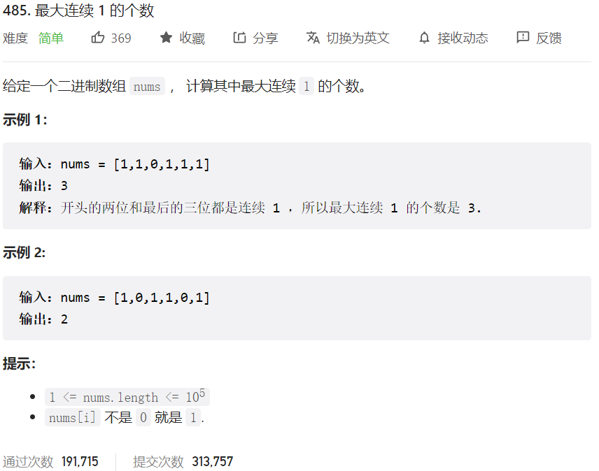



## 题目描述

> 🔥 [485. 最大连续 1 的个数](https://leetcode.cn/problems/max-consecutive-ones/)



## 思路分析

> 数组

## 参考代码

```go
write your code here
```

<a class="button show-hidden">🍏 点击查看 Java 题解</a>

```java
write your code here
```

## 相似题目

| 题目                                                         | 难度   | 题解 |
| ------------------------------------------------------------ | ------ | ---- |
| [最大连续 1 的个数 II](https://leetcode.cn/problems/max-consecutive-ones-ii/) | Medium |      |
| [最大连续 1 的个数 III](https://leetcode.cn/problems/max-consecutive-ones-iii/) | Medium |      |
