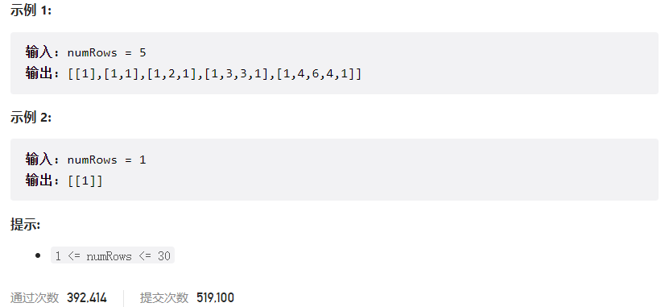



## 题目描述

> 🔥 [118. 杨辉三角](https://leetcode.cn/problems/pascals-triangle/)




## 思路分析

> 思路描述

## 参考代码

```go
write your code here
```

<a class="button show-hidden">🍏 点击查看 Java 题解</a>

```java
write your code here
```

## 相似题目

| 题目                                                         | 难度   | 题解 |
| ------------------------------------------------------------ | ------ | ---- |
| [杨辉三角 II](https://leetcode.cn/problems/pascals-triangle-ii/) | Easy |      |
