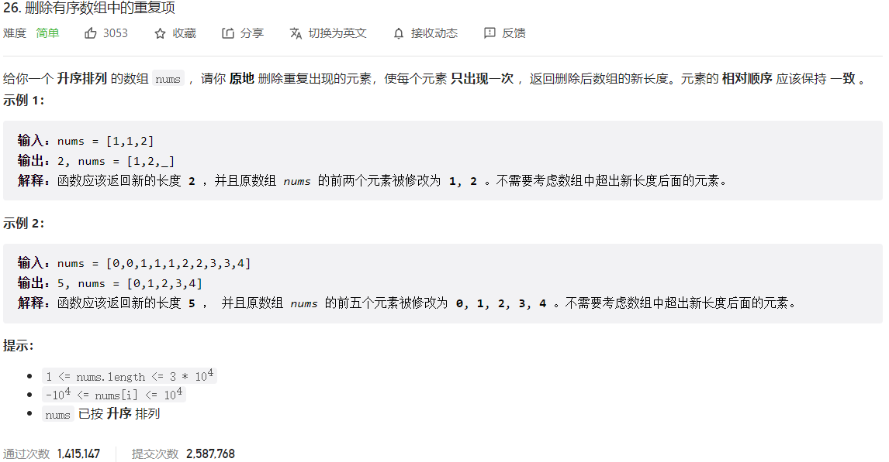



## 题目描述

> 🔥 [26. 删除有序数组中的重复项](https://leetcode.cn/problems/remove-duplicates-from-sorted-array/)



## 思路分析

> 双指针

## 参考代码

```go
func removeDuplicates(nums []int) int {
	i, j := 0, 1
	for j < len(nums) {
		if nums[j] != nums[i] {
			i++
			nums[i] = nums[j]
		}
		j++
	}
	return i + 1
}
```

<a class="button show-hidden">🍏 点击查看 Java 题解</a>

```java
write your code here
```

## 相似题目

| 题目                                                         | 难度   | 题解 |
| ------------------------------------------------------------ | ------ | ---- |
| [移除元素](https://leetcode.cn/problems/remove-element/) | Easy |      |
| [删除有序数组中的重复项 II](https://leetcode.cn/problems/remove-duplicates-from-sorted-array-ii/) | Medium |      |
