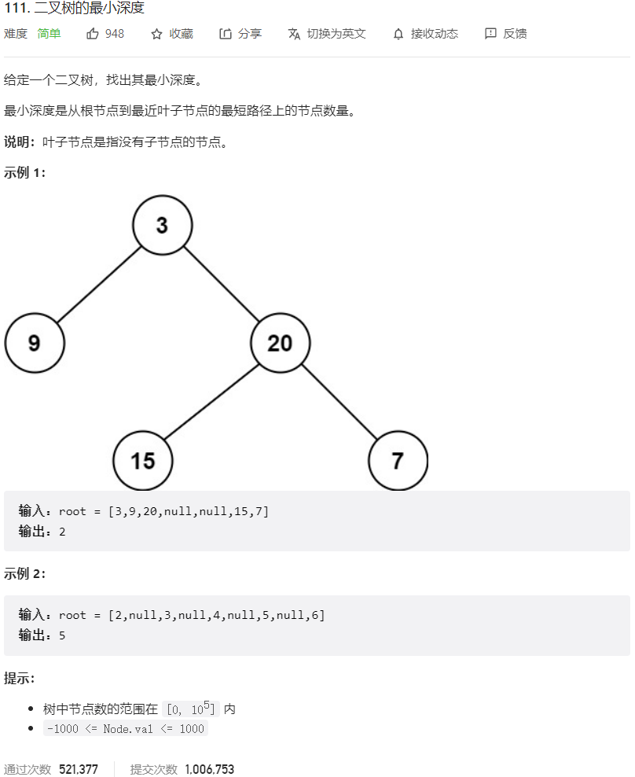



## 题目描述

> 🔥 [111. 二叉树的最小深度](https://leetcode.cn/problems/minimum-depth-of-binary-tree/)



## 思路分析

> 层序遍历

## 参考代码

```go
func minDepth(root *TreeNode) int {
	if root == nil {
		return 0
	}
	if root.Left == nil && root.Right == nil {
		return 1
	}
	leftDepth := minDepth(root.Left)
	rightDepth := minDepth(root.Right)
	if root.Left == nil || root.Right == nil {
		// 如果左子树或右子树为空，只考虑非空子树的深度
		return leftDepth + rightDepth + 1
	}
	return min(leftDepth, rightDepth) + 1
}

func min(a, b int) int {
	if a < b {
		return a
	}
	return b
}
```

<a class="button show-hidden">🍏 点击查看 Java 题解</a>

```java
write your code here
```

## 相似题目

| 题目                                                         | 难度   | 题解 |
| ------------------------------------------------------------ | ------ | ---- |
| [二叉树的层序遍历](https://leetcode.cn/problems/binary-tree-level-order-traversal/) | Medium |      |
| [二叉树的最大深度](https://leetcode.cn/problems/maximum-depth-of-binary-tree/) | Easy |      |
