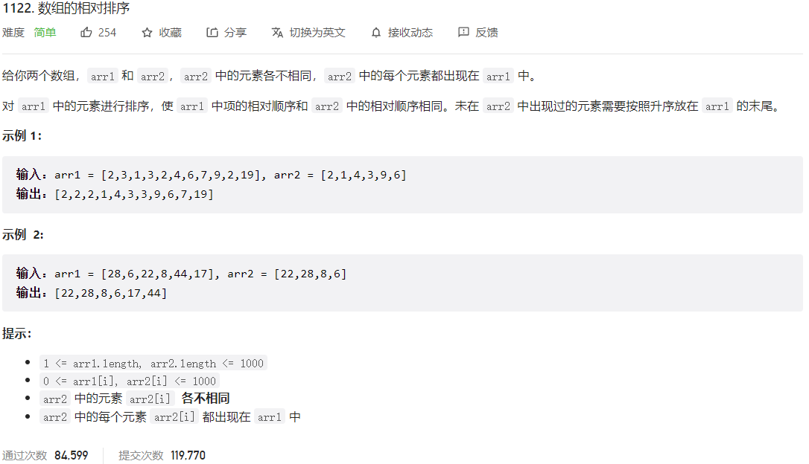



## 题目描述

> 🔥 [1122. 数组的相对排序](https://leetcode.cn/problems/relative-sort-array/)



## 思路分析

> 思路描述

## 参考代码

```go
write your code here
```

<a class="button show-hidden">🍏 点击查看 Java 题解</a>

```java
write your code here
```
