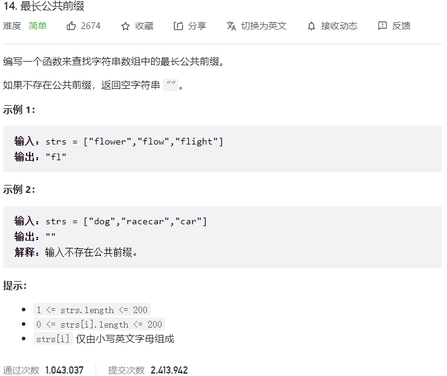



## 题目描述

> 🔥 [14. 最长公共前缀](https://leetcode.cn/problems/longest-common-prefix/)



## 思路分析

> - 首先判断数组是否为空，如果为空则返回空字符串。
> - 取第一个字符串作为基准字符串，遍历基准字符串的每一个字符，依次与其他字符串的对应位置的字符进行比较，如果不相同则返回基准字符串的前缀。
> - 如果遍历完基准字符串的所有字符都相同，则返回基准字符串。

## 参考代码

```go
func longestCommonPrefix(strs []string) string {
	if len(strs) <= 0 {
		return ""
	}
	prefix := strs[0]
	for i := 0; i < len(prefix); i++ {
		for j := 1; j < len(strs); j++ {
			if i >= len(strs[j]) || prefix[i] != strs[j][i] {
				return prefix[:i]
			}
		}
	}
	return prefix
}
```

<a class="button show-hidden">🍏 点击查看 Java 题解</a>

```java
class Solution {
    public String longestCommonPrefix(String[] strs) {
        if (strs == null || strs.length == 0) {
            return "";
        }
        String prefix = strs[0];
        for (int i = 0; i < prefix.length(); i++) {
            for (int j = 1; j < strs.length; j++) {
                if (i >= strs[j].length() || prefix.charAt(i) != strs[j].charAt(i)) {
                    return prefix.substring(0, i);
                }
            }
        }
        return prefix;
    }
}
```

```java
class Solution {
    public String longestCommonPrefix(String[] strs) {
        if (strs == null || strs.length == 0) {
            return "";
        }
        String s = strs[0];
        StringBuilder res = new StringBuilder();
        for (int i = 0; i < s.length(); i++) {
            for (int j = 1; j < strs.length; j++) {
                String p = strs[j];
                if (i >= p.length() || s.charAt(i) != p.charAt(i)) {
                    return res.toString();
                }
            }
            res.append(s.charAt(i));
        }
        return s;
    }
}
```
