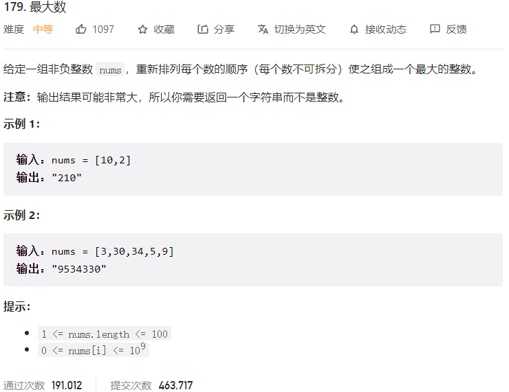



## 题目描述

> 🔥 [179. 最大数](https://leetcode.cn/problems/largest-number/)



## 思路分析

> 将整数转换为字符串，然后按照以下规则排序：
> - 如果 a + b > b + a，则 a 排在 b 前面。
> - 如果 a + b < b + a，则 b 排在 a 前面。
> - 如果 a + b = b + a，则 a 和 b 相对位置不变。
>
> 最后将排序后的字符串拼接起来即可。

## 参考代码

```go
func largestNumber(nums []int) string {
	s := make([]string, len(nums))
	for i := 0; i < len(nums); i++ {
		s[i] = strconv.Itoa(nums[i])
	}
	sort.SliceStable(s, func(i, j int) bool {
		return s[i]+s[j] > s[j]+s[i]
	})
	if s[0] == "0" {
		return "0"
	}
	return strings.Join(s, "")
}
```

<a class="button show-hidden">🍏 点击查看 Java 题解</a>

```java
class Solution {
    public String largestNumber(int[] nums) {
        String[] strs = new String[nums.length];
        for (int i = 0; i < nums.length; i++) {
            strs[i] = String.valueOf(nums[i]);
        }
        Arrays.sort(strs, (o1, o2) -> (o2 + o1).compareTo(o1 + o2));
        String res = String.join("", strs);
        if (res.charAt(0) == '0') {
            return "0";
        }
        return res;
    }
}
```
