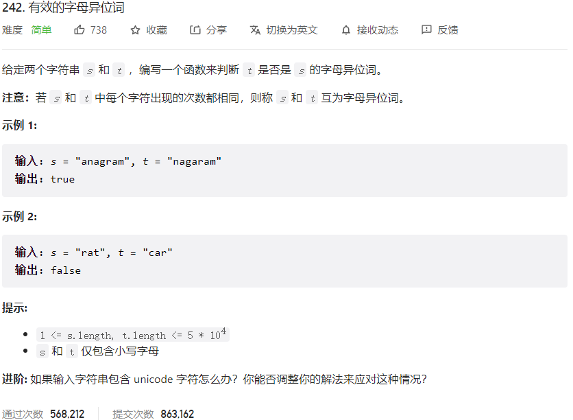



## 题目描述

> 🔥 [242. 有效的字母异位词](https://leetcode.cn/problems/valid-anagram/)



## 思路分析

> 方法一：排序
> 方法二：哈希表

## 参考代码

```go
write your code here
```

<a class="button show-hidden">🍏 点击查看 Java 题解</a>

```java
write your code here
```

## 相似题目

| 题目                                                         | 难度   | 题解 |
| ------------------------------------------------------------ | ------ | ---- |
| [字母异位词分组](https://leetcode.cn/problems/group-anagrams/) | Medium |      |
| [回文排列](https://leetcode.cn/problems/palindrome-permutation/) | Easy |      |
| [找到字符串中所有字母异位词](https://leetcode.cn/problems/find-all-anagrams-in-a-string/) | Medium |      |
