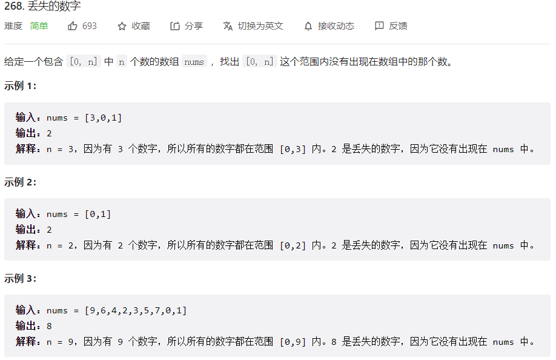
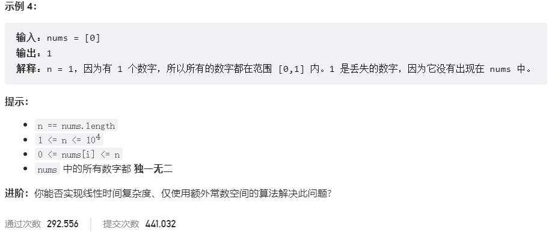



## 题目描述

> 🔥 [268. 丢失的数字](https://leetcode.cn/problems/missing-number/)





## 思路分析

> 方法一：数学方法
>
> 根据等差数列求和公式，可以求出 0 到 n 的和，然后减去给定序列的和，剩下的就是缺失的数字。
>
> 
>
> 方法二：异或运算
>
> 利用异或运算的性质，即 a^b^b=a，可以将序列中的所有数字和 0 到 n 中的所有数字依次异或，最后剩下的就是缺失的数字。
>
> 
>
> 方法三：二分查找

## 参考代码

```go
func missingNumber(nums []int) int {
    sort.Ints(nums)
    left, right := 0, len(nums) - 1
    for left <= right {
        mid := left +(right - left)/2
        if nums[mid] > mid {
            right = mid - 1
        } else {
            left = mid + 1
        }
    }
    return left
}
```

```go
func missingNumber(nums []int) int {
	res := len(nums)
	for i, num := range nums {
		res ^= i
		res ^= num
	}
	return res
}
```

```go
func missingNumber(nums []int) int {
	n := len(nums)
	total := (1 + n) * n / 2
	sum := 0
	for _, num := range nums {
		sum += num
	}
	return total - sum
}
```

<a class="button show-hidden">🍏 点击查看 Java 题解</a>

```java
write your code here
```

## 相似题目

| 题目                                                         | 难度   | 题解 |
| ------------------------------------------------------------ | ------ | ---- |
| [缺失的第一个正数](https://leetcode.cn/problems/first-missing-positive/) | Hard |      |
| [只出现一次的数字](https://leetcode.cn/problems/single-number/) | Easy |      |
| [寻找重复数](https://leetcode.cn/problems/find-the-duplicate-number/) | Medium |      |
| [情侣牵手](https://leetcode.cn/problems/couples-holding-hands/) | Hard |      |
