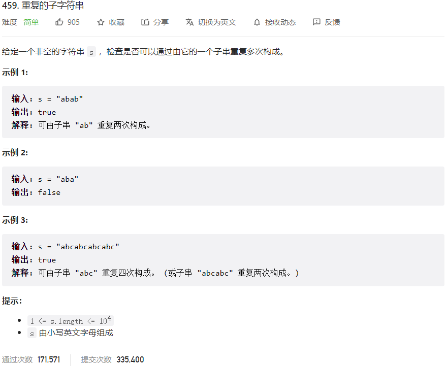



## 题目描述

> 🔥 [459. 重复的子字符串](https://leetcode.cn/problems/repeated-substring-pattern/)



## 思路分析

> 假设原字符串为 s，如果它是由一个子串重复多次构成的，那么将 s 拼接一次并去掉首尾两个字符后，仍然包含原字符串 s。
> 例如，s = "abab"，那么将 s 拼接一次得到"ababab"，去掉首尾两个字符后得到"babab"，仍然包含原字符串 s。
> 因此，我们可以将 s 拼接一次并去掉首尾两个字符，然后判断原字符串 s 是否在新字符串中出现过。

## 参考代码

```go
write your code here
```

<a class="button show-hidden">🍏 点击查看 Java 题解</a>

```java
write your code here
```

## 相似题目

| 题目                                                         | 难度   | 题解 |
| ------------------------------------------------------------ | ------ | ---- |
| [找出字符串中第一个匹配项的下标](https://leetcode.cn/problems/find-the-index-of-the-first-occurrence-in-a-string/) | Medium |      |
| [重复叠加字符串匹配](https://leetcode.cn/problems/repeated-string-match/) | Medium |      |
