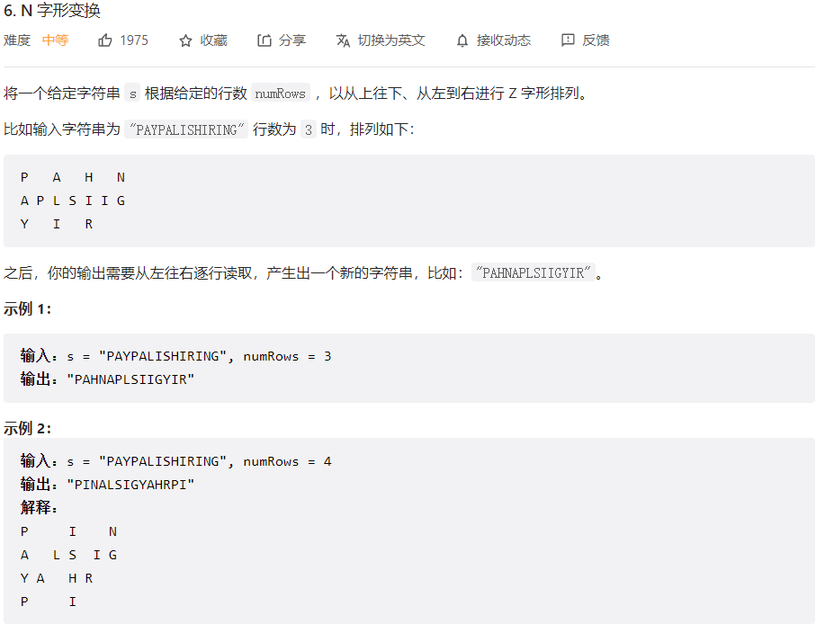
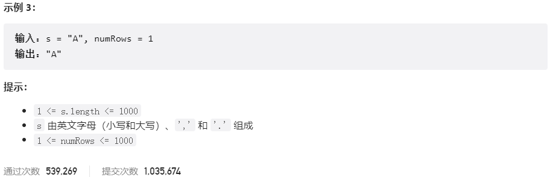
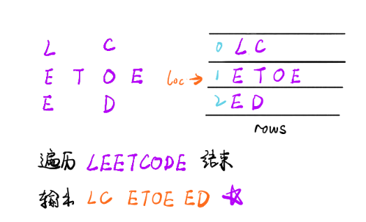



## 题目描述

> 🔥 [6. N 字形变换](https://leetcode.cn/problems/zigzag-conversion/)





## 思路分析

> 方法一：按行排序
>
> 方法二：模拟



## 参考代码

```go
write your code here
```

<a class="button show-hidden">🍏 点击查看 Java 题解</a>

```java
write your code here
```
