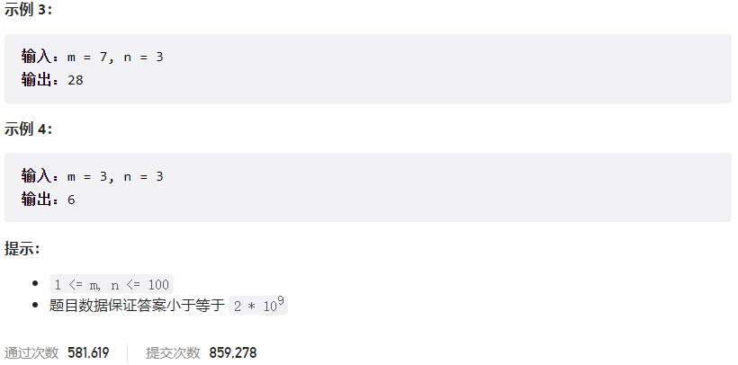



## 题目描述

> 🔥 [62. 不同路径](https://leetcode.cn/problems/unique-paths/)




## 思路分析

> **动态规划**
> 状态定义：`dp[i][j]` 表示从起点 (0, 0) 到达 (i, j) 的不同路径数。

## 参考代码

```go
func uniquePaths(m int, n int) int {
	// dp[i][j] 表示从起点到达坐标 (i, j) 的不同路径数量
	dp := make([][]int, m)
	for i := 0; i < m; i++ {
		dp[i] = make([]int, n)
	}
	for i := 0; i < m; i++ {
		dp[i][0] = 1
	}
	for j := 0; j < n; j++ {
		dp[0][j] = 1
	}
	for i := 1; i < m; i++ {
		for j := 1; j < n; j++ {
			dp[i][j] = dp[i-1][j] + dp[i][j-1]
		}
	}
	return dp[m-1][n-1]
}
```

<a class="button show-hidden">🍏 点击查看 Java 题解</a>

```java
write your code here
```

## 相似题目

| 题目                                                         | 难度   | 题解 |
| ------------------------------------------------------------ | ------ | ---- |
| [不同路径 II](https://leetcode.cn/problems/unique-paths-ii/) | Medium |      |
| [最小路径和](https://leetcode.cn/problems/minimum-path-sum/) | Medium |      |
| [地下城游戏](https://leetcode.cn/problems/dungeon-game/) | Hard |      |
