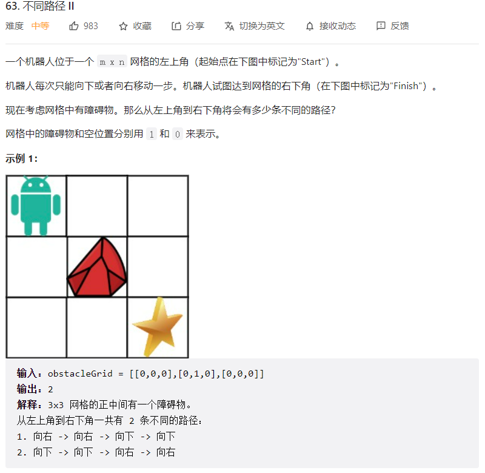
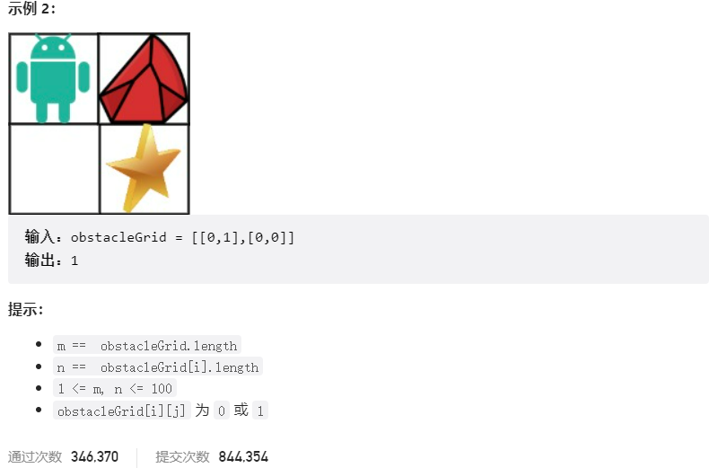



## 题目描述

> 🔥 [63. 不同路径 II](https://leetcode.cn/problems/unique-paths-ii/)





## 思路分析

> **动态规划**
> 状态定义：`dp[i][j]` 表示从起点 (0, 0) 到达 (i, j) 的不同路径数。

## 参考代码

```go
write your code here
```

<a class="button show-hidden">🍏 点击查看 Java 题解</a>

```java
write your code here
```

## 相似题目

| 题目                                                         | 难度   | 题解 |
| ------------------------------------------------------------ | ------ | ---- |
| [不同路径](https://leetcode.cn/problems/unique-paths/) | Medium |      |
| [不同路径 III](https://leetcode.cn/problems/unique-paths-iii/) | Hard |      |
