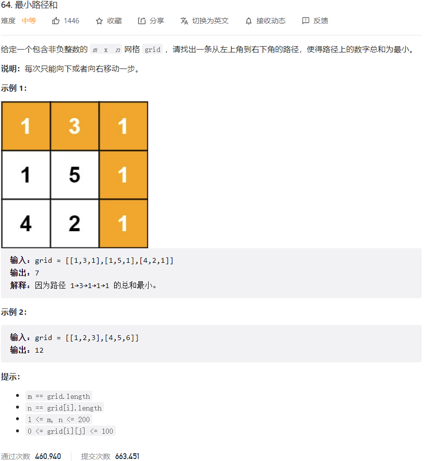



## 题目描述

> 🔥 [64. 最小路径和](https://leetcode.cn/problems/minimum-path-sum/)



## 思路分析

> **动态规划**
> 状态定义：`dp[i][j]` 表示从左上角到 (i, j) 的最小路径和。
> 状态转移：
>
> - 当 i = 0 且 j = 0 时，`dp[i][j]` = `grid[i][j]`；
> - 当 i = 0 且 j ≠ 0 时，`dp[i][j]` = `dp[i][j-1]` + `grid[i][j]`；
> - 当 i ≠ 0 且 j = 0 时，`dp[i][j]` = `dp[i-1][j]` + `grid[i][j]`；
> - 当 i ≠ 0 且 j ≠ 0 时，`dp[i][j]` = min(`dp[i-1][j]`, `dp[i][j-1]`) + `grid[i][j]`。
>
> 最终结果：`dp[-1][-1]`。

## 参考代码

```go
func minPathSum(grid [][]int) int {
	// 状态定义：dp[i][j] 表示从左上角到 (i, j) 的最小路径和。
	m, n := len(grid), len(grid[0])
	dp := make([][]int, 0)
	for i := 0; i < m; i++ {
		dp = append(dp, make([]int, n))
	}
	dp[0][0] = grid[0][0]
	for i := 1; i < m; i++ {
		dp[i][0] = dp[i-1][0] + grid[i][0]
	}
	for j := 1; j < n; j++ {
		dp[0][j] = dp[0][j-1] + grid[0][j]
	}
	for i := 1; i < m; i++ {
		for j := 1; j < n; j++ {
			dp[i][j] = min(dp[i-1][j], dp[i][j-1]) + grid[i][j]
		}
	}
	return dp[m-1][n-1]
}

func min(a, b int) int {
	if a < b {
		return a
	}
	return b
}
```

```go
func minPathSum(grid [][]int) int {
	m := len(grid)
	n := len(grid[0])

	// 初始化二维数组 dp，用于存储路径和
	dp := make([][]int, m)
	for i := 0; i < m; i++ {
		dp[i] = make([]int, n)
	}

	dp[0][0] = grid[0][0] // 起点的路径和就是起点的值

	// 初始化第一行和第一列的路径和
	for i := 1; i < m; i++ {
		dp[i][0] = dp[i-1][0] + grid[i][0]
	}
	for j := 1; j < n; j++ {
		dp[0][j] = dp[0][j-1] + grid[0][j]
	}

	// 动态规划求解路径和
	for i := 1; i < m; i++ {
		for j := 1; j < n; j++ {
			dp[i][j] = min(dp[i-1][j], dp[i][j-1]) + grid[i][j]
		}
	}

	return dp[m-1][n-1] // 返回右下角的路径和
}

func min(a, b int) int {
	if a < b {
		return a
	}
	return b
}
```

<a class="button show-hidden">🍏 点击查看 Java 题解</a>

```java
write your code here
```

## 相似题目

| 题目                                                         | 难度   | 题解 |
| ------------------------------------------------------------ | ------ | ---- |
| [不同路径](https://leetcode.cn/problems/unique-paths/) | Medium |      |
| [地下城游戏](https://leetcode.cn/problems/dungeon-game/) | Hard |      |
| [摘樱桃](https://leetcode.cn/problems/cherry-pickup/) | Hard |      |
