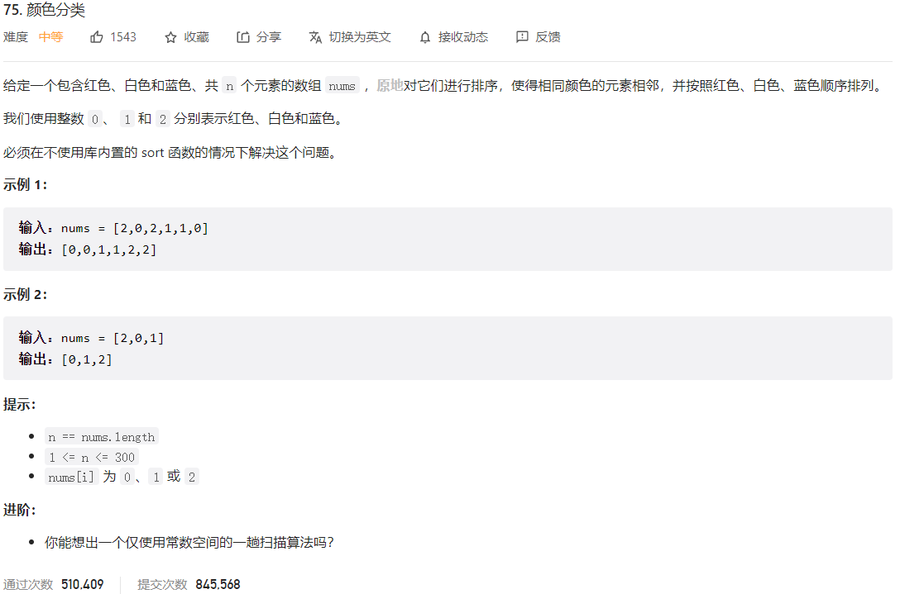



## 题目描述

> 🔥 [75. 颜色分类](https://leetcode.cn/problems/sort-colors/)



## 思路分析

> **思路分析：**
>
> 1. 使用三个指针：`left`、`cur` 和 `right`，分别指向已经处理好的 0 序列的下一个位置、当前待处理元素的位置以及已经处理好的 2 序列的前一个位置。
> 2. 遍历数组，根据当前元素的值进行交换操作：
>    - 如果 `nums[cur]` 等于 0，将其与 `nums[left]` 交换，并将 `left` 和 `cur` 同时右移。
>    - 如果 `nums[cur]` 等于 2，将其与 `nums[right]` 交换，并将 `right` 左移。由于交换后的 `nums[cur]` 可能是 1 或 0，所以不将 `cur` 右移，继续处理这个位置的元素。
>    - 如果 `nums[cur]` 等于 1，不需要交换，将 `cur` 右移。
> 3. 当 `cur` 指针超过 `right` 指针时，排序完成。

## 参考代码

```go
func sortColors(nums []int) {
	left, right := 0, len(nums)-1
	cur := 0
	for cur <= right {
		if nums[cur] == 0 {
			nums[cur], nums[left] = nums[left], nums[cur]
			left++
			cur++
		} else if nums[cur] == 2 {
			nums[cur], nums[right] = nums[right], nums[cur]
			right--
		} else {
			cur++
		}
	}
}
```

<a class="button show-hidden">🍏 点击查看 Java 题解</a>

```java
write your code here
```

## 拓展题目

>题目描述：给定一个包含正整数的数组，要求按照以下规则对数组进行排序，同时保持常数空间复杂度：
>
>1. 将数组中对 3 取模等于 0 的元素移动到数组的左边。
>2. 将数组中对 3 取模等于 2 的元素移动到数组的右边。
>3. 对 3 取模等于 1 的元素可以保持不变，不做特殊处理。
>

>使用荷兰国旗问题的思路，通过交换数组中的元素，按照上述规则进行排序。

```go
func sortColors(nums []int) {
	left, right := 0, len(nums)-1
	i := 0
	for i <= right {
		switch nums[i] % 3 {
		case 0:
			nums[left], nums[i] = nums[i], nums[left]
			left++
			i++
		case 1:
			i++
		case 2:
			nums[right], nums[i] = nums[i], nums[right]
			right--
		}
	}
}

func main() {
	nums := []int{2, 1, 0, 2, 0, 1, 2, 1, 0}
	sortColors(nums)
	fmt.Println(nums) // 输出结果应为 [0 0 0 1 1 1 2 2 2]

	nums = []int{7, 15, 11, 9, 8, 10, 13, 5, 6, 4}
	sortColors(nums)
	fmt.Println(nums) // 输出结果应为 [15 9 6 7 4 10 13 5 8 11]
}
```

## 相似题目

| 题目                                                         | 难度   | 题解 |
| ------------------------------------------------------------ | ------ | ---- |
| [排序链表](https://leetcode.cn/problems/sort-list/) | Medium |      |
| [摆动排序](https://leetcode.cn/problems/wiggle-sort/) | Medium |      |
| [摆动排序 II](https://leetcode.cn/problems/wiggle-sort-ii/) | Medium |      |
