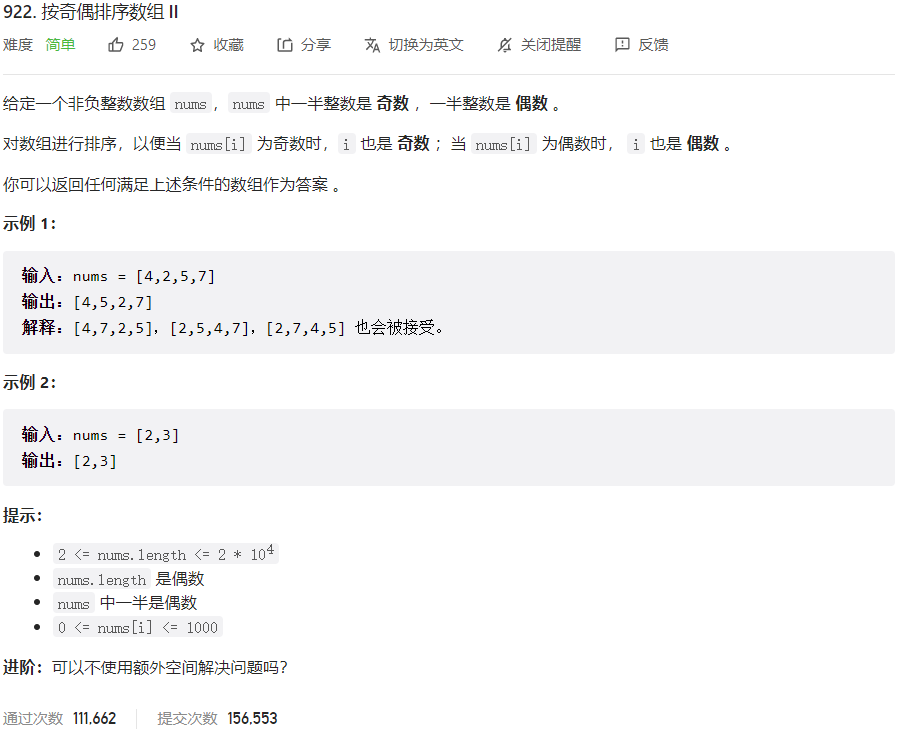



## 题目描述

> 🔥 [922. 按奇偶排序数组 II](https://leetcode.cn/problems/sort-array-by-parity-ii/)



## 思路分析

> 思路描述

## 参考代码

```go
write your code here
```

<a class="button show-hidden">🍏 点击查看 Java 题解</a>

```java
write your code here
```
