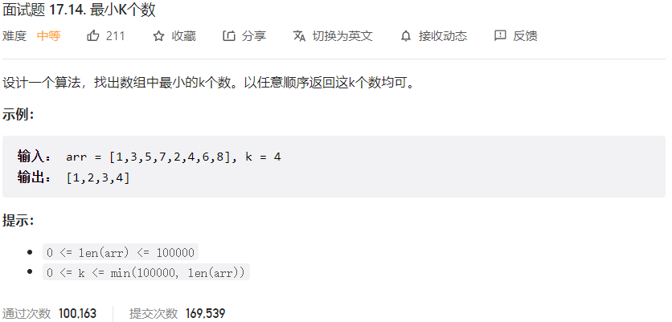



## 题目描述

> 🔥 [面试题 17.14. 最小 K 个数](https://leetcode.cn/problems/smallest-k-lcci/)



## 思路分析

> 大顶堆

## 参考代码

```go
write your code here
```

<a class="button show-hidden">🍏 点击查看 Java 题解</a>

```java
write your code here
```
