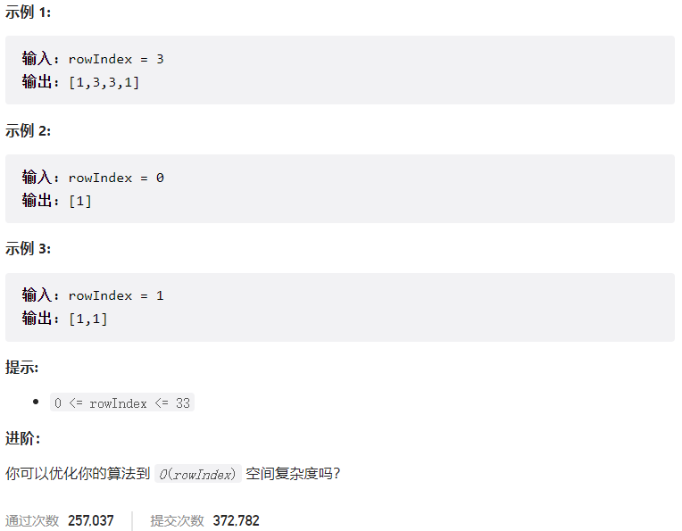



## 题目描述

> 🔥 [119. 杨辉三角 II](https://leetcode.cn/problems/pascals-triangle-ii/)




## 思路分析

> 1. 初始化一个列表 `row`，用来存储当前行的元素。
> 2. 首先，将 `1` 添加到 `row` 中，作为第一项。
> 3. 进行循环从第二行开始，每次生成新的行，并更新 `row`。
>    - 遍历 `row` 列表，从第二项到倒数第二项（因为首尾都是 `1`，无需改变）。
>    - 对于每个位置，新的值是上一行同位置和前一位置的元素之和。
>    - 将新的值添加到一个临时列表 `new_row` 中。
>    - 在 `new_row` 列表末尾添加 `1`，得到新的一行。
>    - 更新 `row` 为 `new_row`，进行下一轮循环。
> 4. 循环结束后，`row` 列表中存储的即为所需的第 `rowIndex` 行的元素。

```go
1
1 1
1 2 1
1 3 3 1
1 4 6 4 1
...
```

## 参考代码

```go
write your code here
```

<a class="button show-hidden">🍏 点击查看 Java 题解</a>

```java
write your code here
```

## 相似题目

| 题目                                                         | 难度   | 题解 |
| ------------------------------------------------------------ | ------ | ---- |
| [杨辉三角](https://leetcode.cn/problems/pascals-triangle/) | Easy |      |
