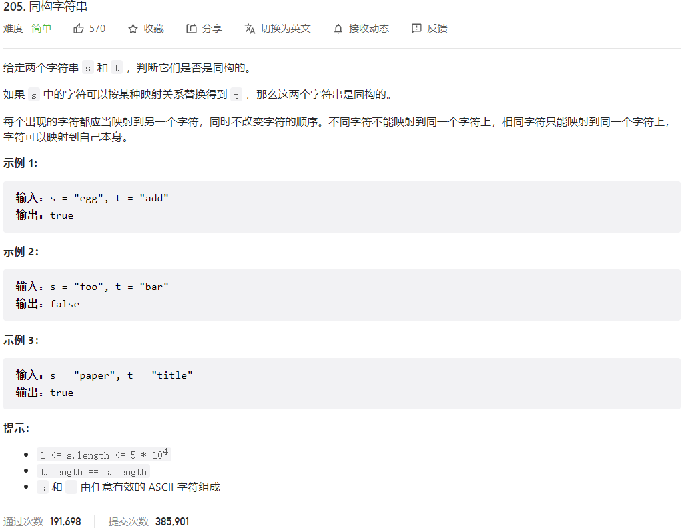



## 题目描述

> 🔥 [205. 同构字符串](https://leetcode.cn/problems/isomorphic-strings/)



## 思路分析

> 遍历字符串 s 和 t，将每个字符映射到一个数字上，如果两个字符串中相同的字符映射到的数字不同，则不是同构字符串。

## 参考代码

```go
func isIsomorphic(s string, t string) bool {
	if len(s) != len(t) {
		return false
	}
	n := len(s)
	charMapS := make(map[byte]int)
	charMapT := make(map[byte]int)
	for i := 0; i < n; i++ {
		charS, charT := s[i], t[i]
		if _, ok := charMapS[charS]; !ok {
			charMapS[charS] = i
		}
		if _, ok := charMapT[charT]; !ok {
			charMapT[charT] = i
		}
		if charMapS[charS] != charMapT[charT] {
			return false
		}
	}
	return true
}
```

<a class="button show-hidden">🍏 点击查看 Java 题解</a>

```java
write your code here
```

## 相似题目

| 题目                                                         | 难度   | 题解 |
| ------------------------------------------------------------ | ------ | ---- |
| [单词规律](https://leetcode.cn/problems/word-pattern/) | Easy |      |
