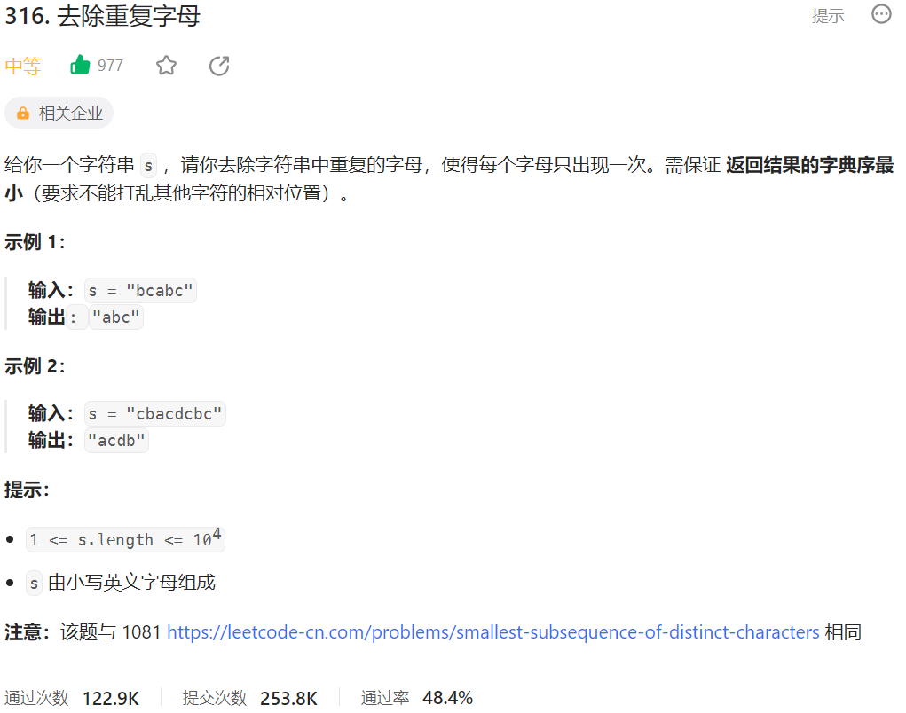



## 题目描述

> 🔥 [316. 去除重复字母](https://leetcode.cn/problems/remove-duplicate-letters/)



## 思路分析

> 思路描述

## 参考代码

```go
func removeDuplicateLetters(s string) string {
	var stack []byte
	lastOccurrence := make(map[byte]int)
	visited := make(map[byte]bool)
	// 记录每个字符的最后出现位置
	for i := 0; i < len(s); i++ {
		lastOccurrence[s[i]] = i
	}
	for i := 0; i < len(s); i++ {
		c := s[i]
		// 如果字符已经在栈中，跳过
		if visited[c] {
			continue
		}
		// 如果栈不为空，并且当前字符比栈顶字符小，
		// 且栈顶字符在后面还会出现，则出栈
		for len(stack) > 0 && c < stack[len(stack)-1] && i < lastOccurrence[stack[len(stack)-1]] {
			delete(visited, stack[len(stack)-1])
			stack = stack[:len(stack)-1]
		}
		// 将当前字符入栈
		stack = append(stack, c)
		visited[c] = true
	}
	return string(stack)
}
```

<a class="button show-hidden">🍏 点击查看 Java 题解</a>

```java
write your code here
```
