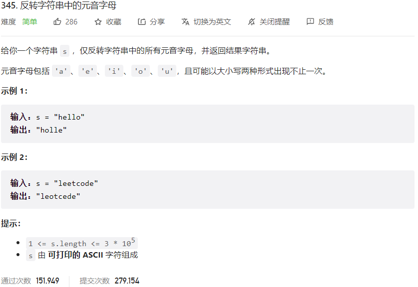



## 题目描述

> 🔥 [345. 反转字符串中的元音字母](https://leetcode.cn/problems/reverse-vowels-of-a-string/)



## 思路分析

> **双指针**
> 使用双指针，一个指向字符串头部，一个指向字符串尾部，分别判断是否为元音字母，如果都是元音字母，则交换两个指针所指的字符。

## 参考代码

```go
write your code here
```

<a class="button show-hidden">🍏 点击查看 Java 题解</a>

```java
write your code here
```

## 相似题目

| 题目                                                         | 难度   | 题解 |
| ------------------------------------------------------------ | ------ | ---- |
| [反转字符串](https://leetcode.cn/problems/reverse-string/) | Easy |      |
| [删去字符串中的元音](https://leetcode.cn/problems/remove-vowels-from-a-string/) | Easy |      |
