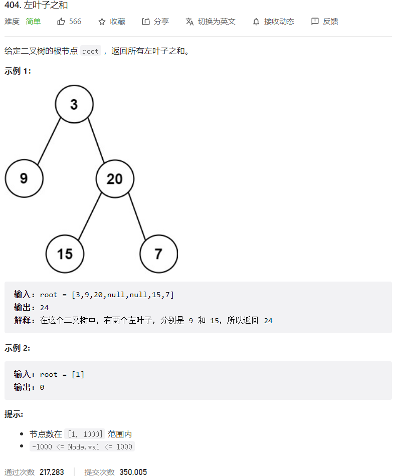



## 题目描述

> 🔥 [404. 左叶子之和](https://leetcode.cn/problems/sum-of-left-leaves/)



## 思路分析

> 解题思路

## 参考代码

```go
func sumOfLeftLeaves(root *TreeNode) int {
	if root == nil {
		return 0
	}
	sum := 0
	if root.Left != nil && root.Left.Left == nil && root.Left.Right == nil {
		sum += root.Left.Val
	}
	sum += sumOfLeftLeaves(root.Left)
	sum += sumOfLeftLeaves(root.Right)
	return sum
}
```

```go
type QueueNode struct {
	Node   *TreeNode
	IsLeft bool
}

func sumOfLeftLeaves(root *TreeNode) int {
	if root == nil {
		return 0
	}
	queue := []*QueueNode{&QueueNode{Node: root, IsLeft: false}}
	totalSum := 0
	for len(queue) > 0 {
		node, isLeft := queue[0].Node, queue[0].IsLeft
		queue = queue[1:]
		if isLeft && node.Left == nil && node.Right == nil {
			totalSum += node.Val
		}
		if node.Left != nil {
			queue = append(queue, &QueueNode{Node: node.Left, IsLeft: true})
		}
		if node.Right != nil {
			queue = append(queue, &QueueNode{Node: node.Right, IsLeft: false})
		}
	}
	return totalSum
}
```

<a class="button show-hidden">🍏 点击查看 Java 题解</a>

```java
write your code here
```
