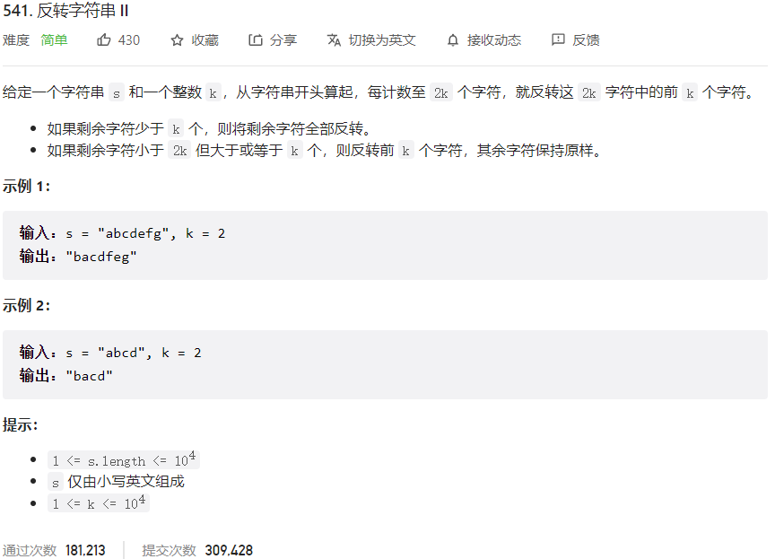



## 题目描述

> 🔥 [541. 反转字符串 II](https://leetcode.cn/problems/reverse-string-ii/)



## 思路分析

> - 首先将字符串转换为列表，方便操作。
> - 每隔 2k 个字符，对前 k 个字符进行反转。
> - 如果剩余字符不足 k 个，则将剩余字符全部反转。

## 参考代码

```go
func reverseStr(s string, k int) string {
	runes := []rune(s)
	n := len(runes)

	for i := 0; i < n; i += 2 * k {
		left := i
		right := i + k - 1
		if right >= n {
			right = n - 1
		}

		for left < right {
			runes[left], runes[right] = runes[right], runes[left]
			left++
			right--
		}
	}

	return string(runes)
}
```

<a class="button show-hidden">🍏 点击查看 Java 题解</a>

```java
write your code here
```

## 相似题目

| 题目                                                         | 难度   | 题解 |
| ------------------------------------------------------------ | ------ | ---- |
| [反转字符串](https://leetcode.cn/problems/reverse-string/) | Easy |      |
| [反转字符串中的单词 III](https://leetcode.cn/problems/reverse-words-in-a-string-iii/) | Easy |      |
