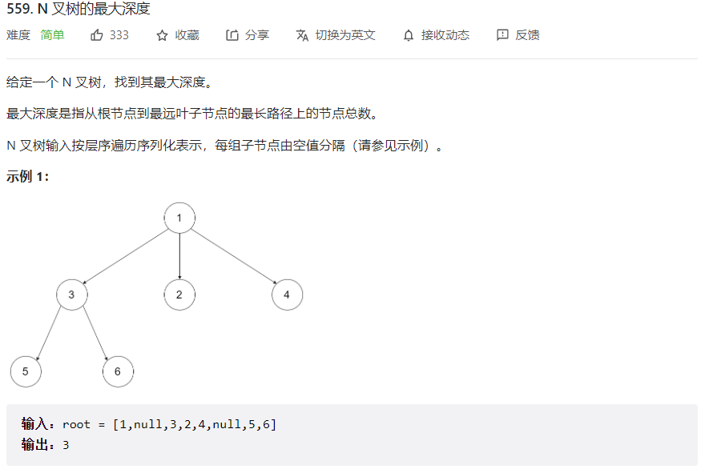
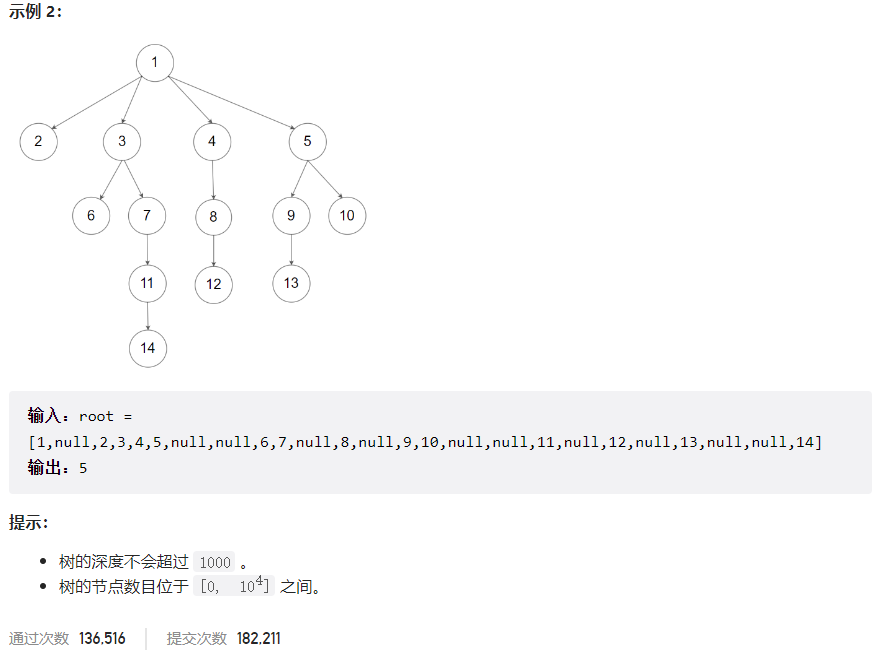



## 题目描述

> 🔥 [559. N 叉树的最大深度](https://leetcode.cn/problems/maximum-depth-of-n-ary-tree/)





## 思路分析

> 解法一：递归
> 递归遍历每个节点，计算每个节点的深度，最后返回最大深度。
>
> 解法二：迭代
> 使用 BFS 迭代遍历每个节点，记录每层的节点数，最后返回层数。
>
> 解法三：DFS
> 使用 DFS 遍历每个节点，记录每个节点的深度，最后返回最大深度。

## 参考代码

```go
func maxDepth(root *Node) int {
	if root == nil {
		return 0
	}
	maxChildDepth := 0
	for _, child := range root.Children {
		childDepth := maxDepth(child)
		if childDepth > maxChildDepth {
			maxChildDepth = childDepth
		}
	}
	return maxChildDepth + 1
}
```

<a class="button show-hidden">🍏 点击查看 Java 题解</a>

```java
write your code here
```

## 相似题目

| 题目                                                         | 难度   | 题解 |
| ------------------------------------------------------------ | ------ | ---- |
| [二叉树的最大深度](https://leetcode.cn/problems/maximum-depth-of-binary-tree/) | Easy |      |
