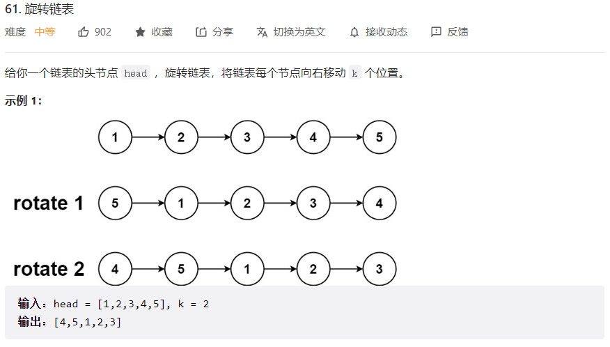
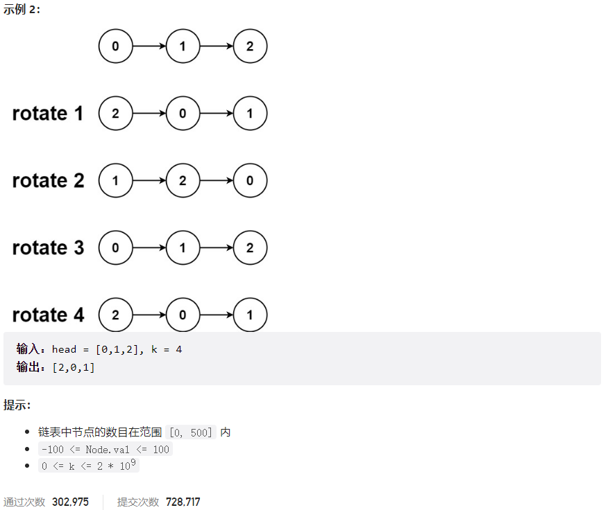



## 题目描述

> 🔥 [61. 旋转链表](https://leetcode.cn/problems/rotate-list/)





## 思路分析

> - 首先遍历链表，找到链表的尾节点，并计算出链表的长度 n。
> - 将链表的尾节点指向链表的头节点，形成一个环。
> - 然后找到新链表的尾节点，即第 n-k%n 个节点，将其下一个节点作为新链表的头节点，断开环即可。

## 参考代码

```go
func rotateRight(head *ListNode, k int) *ListNode {
	if head == nil || head.Next == nil || k == 0 {
		return head
	}
	// 计算链表长度并找到尾节点
	cur := head
	n := 1
	for cur.Next != nil {
		n++
		cur = cur.Next
	}
	// 形成循环链表
	cur.Next = head
	// 实际需要移动的步数
	k = k % n
	// 找到新的头部和尾部
	for i := 0; i < n-k; i++ {
		cur = cur.Next
	}
	newHead := cur.Next
	cur.Next = nil
	return newHead
}
```

<a class="button show-hidden">🍏 点击查看 Java 题解</a>

```java
class Solution {
    public ListNode rotateRight(ListNode head, int k) {
        if (head == null || head.next == null || k == 0) {
            return head;
        }
        int n = 1;
        ListNode cur = head;
        while (cur.next != null) {
            n++;
            cur = cur.next;
        }
        k = k % n;
        if (k == 0) {
            return head;
        }
        cur.next = head;
        for (int i = 0; i < n - k; i++) {
            cur = cur.next;
        }
        ListNode newHead = cur.next;
        cur.next = null;
        return newHead;
    }
}
```

## 相似题目

| 题目                                                         | 难度   | 题解 |
| ------------------------------------------------------------ | ------ | ---- |
| [轮转数组](https://leetcode.cn/problems/rotate-array/) | Medium |      |
| [分隔链表](https://leetcode.cn/problems/split-linked-list-in-parts/) | Medium |      |
