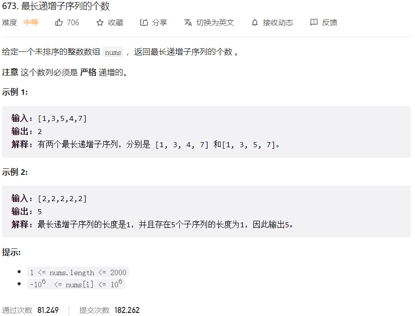



## 题目描述

> 🔥 [673. 最长递增子序列的个数](https://leetcode.cn/problems/number-of-longest-increasing-subsequence/)



## 思路分析

> 本题可以使用动态规划来解决，我们可以使用两个数组来记录以每个元素为结尾的最长递增子序列的长度和个数。
>
> - 具体来说，我们可以使用 dp[i] 来记录以 nums[i] 为结尾的最长递增子序列的长度，count[i] 来记录以 nums[i] 为结尾的最长递增子序列的个数。
>
> - 对于每个元素 nums[i]，我们需要遍历它之前的所有元素 nums[j]，如果 nums[j] < nums[i]，则说明 nums[i] 可以接在 nums[j] 后面形成一个更长的递增子序列，此时我们需要更新 dp[i] 和 count[i]。
>
> - 如果 dp[j] + 1 > dp[i]，则说明我们找到了一个更长的递增子序列，此时需要更新 dp[i] 和 count[i]，并将 count[i] 设为 count[j]；如果 dp[j] + 1 == dp[i]，则说明我们找到了一个长度相同的递增子序列，此时需要将 count[i] 加上 count[j]。
>
> - 最后，我们需要遍历整个 dp 数组，找到最长递增子序列的长度，然后统计所有长度为最长递增子序列长度的 count 值之和即可。

## 参考代码

```go
write your code here
```

<a class="button show-hidden">🍏 点击查看 Java 题解</a>

```java
write your code here
```

## 相似题目

| 题目                                                         | 难度   | 题解 |
| ------------------------------------------------------------ | ------ | ---- |
| [最长递增子序列](https://leetcode.cn/problems/longest-increasing-subsequence/) | Medium |      |
| [最长连续递增序列](https://leetcode.cn/problems/longest-continuous-increasing-subsequence/) | Easy |      |
