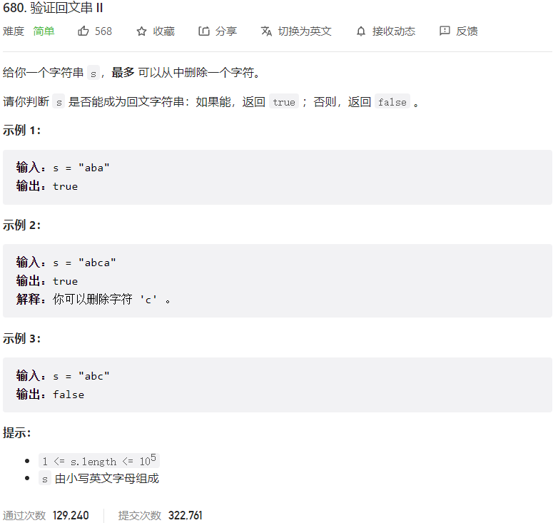



## 题目描述

> 🔥 [680. 验证回文串 II](https://leetcode.cn/problems/valid-palindrome-ii/)



## 思路分析

> **双指针法**
> 首先，我们可以使用双指针法来判断一个字符串是否为回文串。具体来说，我们可以使用两个指针，一个指向字符串的开头，另一个指向字符串的结尾，然后分别向中间移动，每次比较两个指针所指向的字符是否相同，如果不同，则说明该字符串不是回文串。
> 那么，如果我们最多只能删除一个字符，那么我们可以在遇到不同的字符时，分别尝试删除左指针所指向的字符或右指针所指向的字符，然后再判断剩下的字符串是否为回文串。

## 参考代码

```go
func validPalindrome(s string) bool {
	left, right := 0, len(s)-1
	for left < right {
		if s[left] != s[right] {
			// 尝试删除左边或右边的字符，判断剩下的部分是否是回文串
			return isPalindrome(s, left+1, right) || isPalindrome(s, left, right-1)
		}
		left++
		right--
	}
	return true
}

func isPalindrome(s string, left, right int) bool {
	for left < right {
		if s[left] != s[right] {
			return false
		}
		left++
		right--
	}
	return true
}
```

<a class="button show-hidden">🍏 点击查看 Java 题解</a>

```java
write your code here
```

## 相似题目

| 题目                                                         | 难度   | 题解 |
| ------------------------------------------------------------ | ------ | ---- |
| [验证回文串](https://leetcode.cn/problems/valid-palindrome/) | Easy |      |
