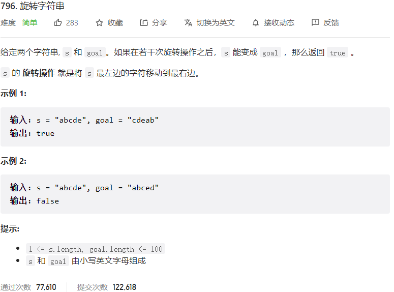



## 题目描述

> 🔥 [796. 旋转字符串](https://leetcode.cn/problems/rotate-string/)



## 思路分析

> 思路描述

## 参考代码

```go
func rotateString(s string, goal string) bool {
	if len(s) != len(goal) {
		return false
	}
	s = s + s
	return strings.Contains(s, goal)
}
```

<a class="button show-hidden">🍏 点击查看 Java 题解</a>

```java
write your code here
```
