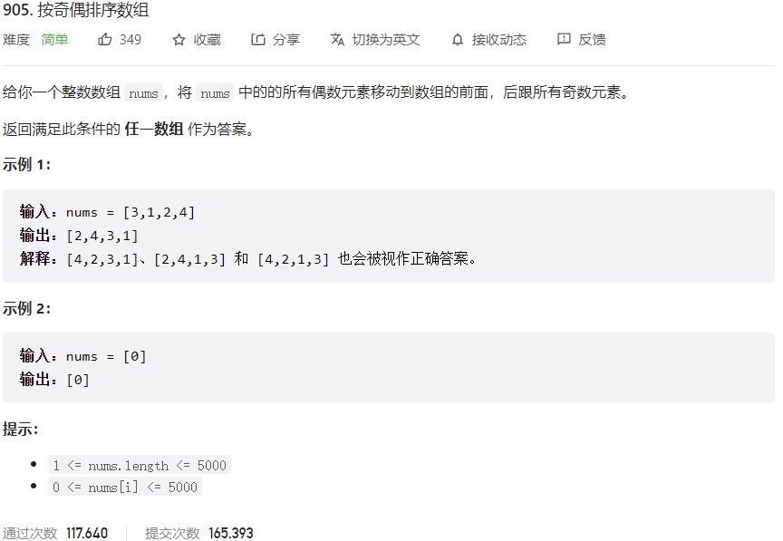



## 题目描述

> 🔥 [905. 按奇偶排序数组](https://leetcode.cn/problems/sort-array-by-parity/)



## 思路分析

> 双指针

## 参考代码

```go
write your code here
```

<a class="button show-hidden">🍏 点击查看 Java 题解</a>

```java
class Solution {
    public int[] sortArrayByParity(int[] nums) {
        if (nums == null || nums.length <= 1) {
            return nums;
        }
        int i = 0, j = nums.length - 1;
        while (i < j) {
            while (i < j && nums[i] % 2 == 0) {
                i++;
            }
            while (i < j && nums[j] % 2 != 0) {
                j--;
            }
            if (i < j) {
                int temp = nums[i];
                nums[i] = nums[j];
                nums[j] = temp;
            }
        }
        return nums;
    }
}
```
