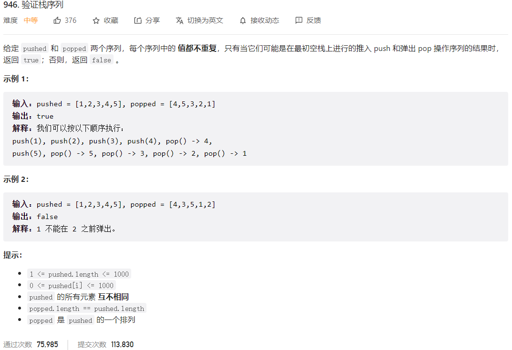



## 题目描述

> 🔥 [946. 验证栈序列](https://leetcode.cn/problems/validate-stack-sequences/)



## 思路分析

> - 模拟栈的操作，遍历 pushed 数组，将元素依次入栈，每次入栈后判断栈顶元素是否等于 popped 数组的当前元素，如果相等则将栈顶元素出栈，popped 数组的指针后移一位，继续判断下一个元素是否相等，直到不相等或者栈为空为止。
> - 如果最后栈为空，则说明 pushed 和 popped 数组是合法的栈序列，否则不合法。

## 参考代码

```go
write your code here
```

<a class="button show-hidden">🍏 点击查看 Java 题解</a>

```java
write your code here
```
