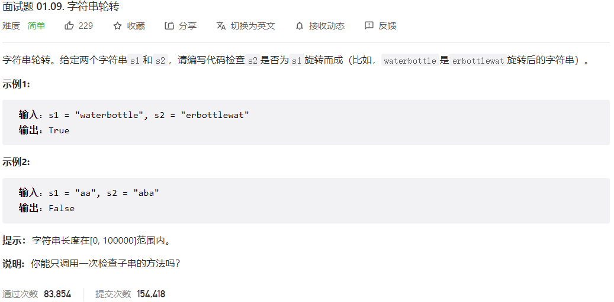



## 题目描述

> 🔥 [面试题 01.09. 字符串轮转](https://leetcode.cn/problems/string-rotation-lcci/)



## 思路分析

> 解法一：暴力枚举
> 解法二：字符串拼接

## 参考代码

```go
write your code here
```

<a class="button show-hidden">🍏 点击查看 Java 题解</a>

```java
write your code here
```
