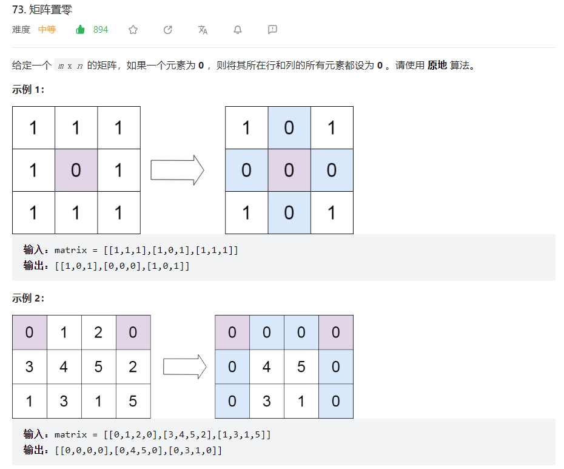
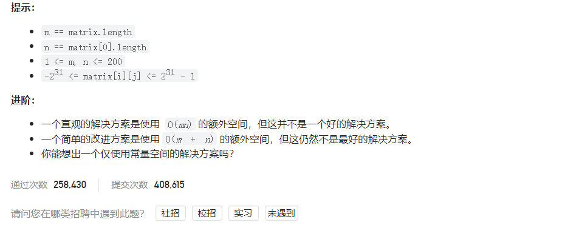



## 题目描述

> 🔥 [73. 矩阵置零](https://leetcode.cn/problems/set-matrix-zeroes/)





## 思路分析

> **解题思路：**
>
> 1. 遍历矩阵，用两个集合分别记录需要置零的行和列。
> 2. 遍历矩阵，将需要置零的行和列的元素置为 0。
>
> **具体步骤：**
> 1. 初始化两个集合 rows 和 cols，用于记录需要置零的行和列。
> 2. 遍历矩阵，如果 matrix[i][j] 为 0，则将 i 加入 rows，将 j 加入 cols。
> 3. 遍历矩阵，如果 i 在 rows 中或者 j 在 cols 中，则将 matrix[i][j] 置为 0。
>
> 时间复杂度：O(m * n)，其中 m 和 n 分别为矩阵的行数和列数。
> 空间复杂度：O(m + n)，其中 m 和 n 分别为矩阵的行数和列数。

## 参考代码

```go
func setZeroes(matrix [][]int) {
	m := len(matrix)
	n := len(matrix[0])
	rows := make([]bool, m)
	cols := make([]bool, n)
	// 标记含有零元素的行和列
	for i := 0; i < m; i++ {
		for j := 0; j < n; j++ {
			if matrix[i][j] == 0 {
				rows[i] = true
				cols[j] = true
			}
		}
	}
	// 将相应行和列置为零
	for i := 0; i < m; i++ {
		for j := 0; j < n; j++ {
			if rows[i] || cols[j] {
				matrix[i][j] = 0
			}
		}
	}
}
```

<a class="button show-hidden">🍏 点击查看 Java 题解</a>

```java
write your code here
```

## 相似题目

| 题目                                                         | 难度   | 题解 |
| ------------------------------------------------------------ | ------ | ---- |
| [生命游戏](https://leetcode.cn/problems/game-of-life/) | Medium |      |
