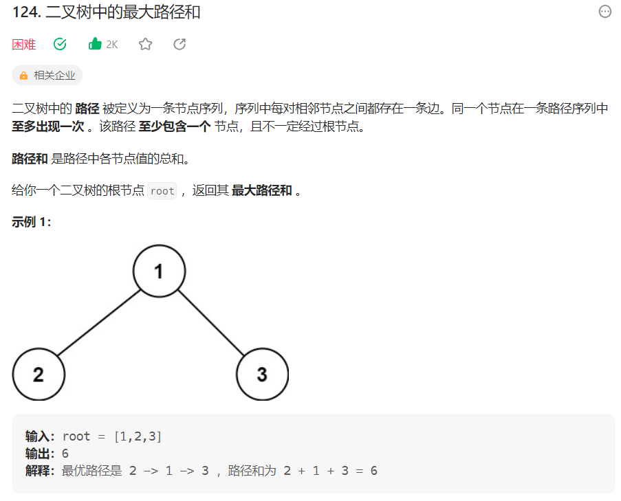
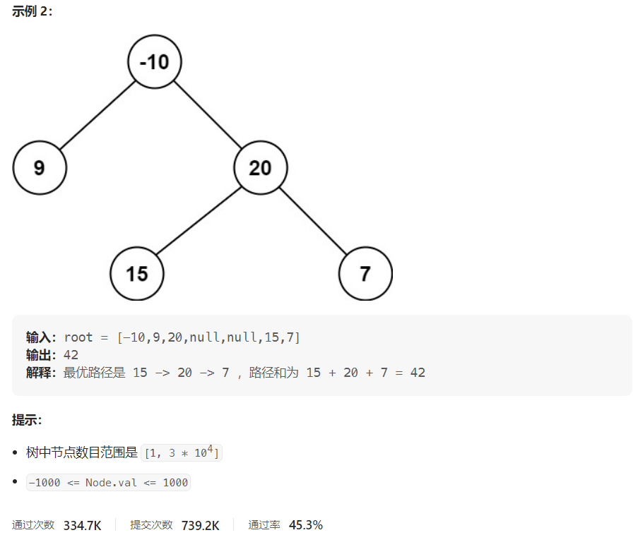



## 题目描述

> 🔥 [124. 二叉树中的最大路径和](https://leetcode.cn/problems/binary-tree-maximum-path-sum/)





## 思路分析

> 思路描述

## 参考代码

```go
var maxSum int

func maxPathSum(root *TreeNode) int {
	maxSum = math.MinInt32
	findMaxPathSum(root)
	return maxSum
}

func findMaxPathSum(node *TreeNode) int {
	if node == nil {
		return 0
	}

	leftMax := max(findMaxPathSum(node.Left), 0)
	rightMax := max(findMaxPathSum(node.Right), 0)

	currentPathSum := node.Val + leftMax + rightMax
	maxSum = max(maxSum, currentPathSum)

	return node.Val + max(leftMax, rightMax)
}

func max(a, b int) int {
	if a > b {
		return a
	}
	return b
}
```

<a class="button show-hidden">🍏 点击查看 Java 题解</a>

```java
write your code here
```

## 相似题目

| 题目                                                         | 难度   | 题解 |
| ------------------------------------------------------------ | ------ | ---- |
| [路径总和](https://leetcode.cn/problems/path-sum/) | Easy |      |
| [求根节点到叶节点数字之和](https://leetcode.cn/problems/sum-root-to-leaf-numbers/) | Medium |      |
| [路径总和 IV](https://leetcode.cn/problems/path-sum-iv/) | Medium |      |
| [最长同值路径](https://leetcode.cn/problems/longest-univalue-path/) | Medium |      |
